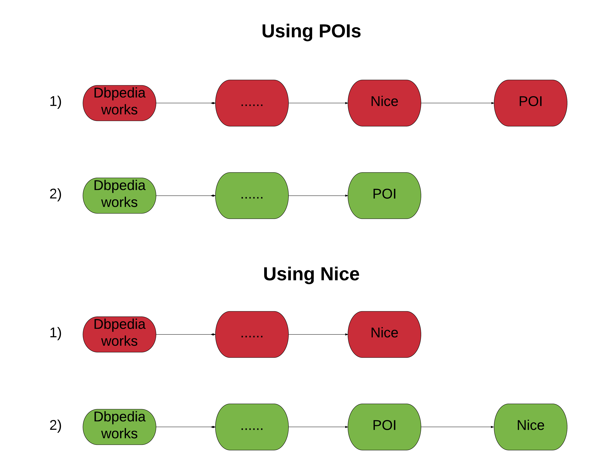

# DOREMUS Relfinder

To link find paths between works and POIs, we are trying to use Relfinder both for Dbpedia and Wikidata.
The script that performs this action is called `SubProc.py`. It can perform different operation depending
on the command line arguments passed to.
It takes as input file one or two files in the folder `input_files` and it writes new files in the folder `output_files` 
that is created when the script runs for the first time. Then it is possible to stop running and continue the execution
in the future. The script automatically keeps trace of the work already done.

## Problems and alternatives

Trying running the script, we have noted that it takes a very long time. In fact:

* We have k works, where **k** is a number comprised between 5000 and 40000 depending on the filtering accuracy and on the used ontology (Dbpedia or Wikidata)
* For each of them, we have to laung Relfinder **n** times, where **n** is the number of POIs (between 80-200)
* Totally we have to launch **n** * **k** times Relfinder
* For every relfinder launch, there is a number of queries, proportional to the max explored depth

As you can deduce, when the number of works and POIs is high, the algorithm is too slow. To solve this problem we thought to not pass to Relfinder the POIs but to pass the Nice entity, increasing the max depth. This suggestion is justified by the hyphotesis that every POI should be linked with Nice, being a Nice POI. Teorically this is true, but we have noted that in Wikidata some POIs are not linked with Nice and in Dbpedia some POIs are too far from the Nice entity. However these are a minority, so we think that this is a good alternative. As Nice entity, we'll use:

* the entity [http://www.wikidata.org/entity/Q33959](http://www.wikidata.org/entity/Q33959) for Wikidata
* the entity [http://dbpedia.org/resource/Nice](http://dbpedia.org/resource/Nice) or [http://dbpedia.org/resource/Category:Nice](http://dbpedia.org/resource/Category:Nice)  for DBpedia

Below there is a graph that shows the case in which we try linking directly works and POIs and the case in which we link works and Nice. In addition the possible paths are showed; the red ones are the bad ones, in which the work is linked with Nice beore, and then from Nice to the specic POI. In this case the work will be linked with all POIs linked with Nice and this is not good because we'll have low discimination. This case is the one that disappears when we genearally link the works with Nice, but this is not a big problem because we are not really interested to these links.

## How to execute the script?

To execute `SubProc.py` understanding the right command line argument to pass is foudamental. In fact you can run the script using Dbpedia or Wikidata, the list of POIs or the Nice entity, and so on. The script has to recieve 3 arguments:

| Number | Name |Description
|---|---|---|
1 |`Input works file` |It is the filepath where are contained all works for which we want to execute Relfinder
2 |`Input POIS file` or  `Nice`|It is the filepath where are contained all POIS for which we want to execute Relfinder or the string "Nice" if we want to execute Relfinder generically for Nice
3 |`The number of threads` |We have seen that it's better to execute the scrpit using 100 threads

So basically we have 4 possible alternatives (commands) to execute the script:

* For DBpedia
  1. `python Subproc.py input_files/2_4_doremus_dbpedia_works.csv input_files/3cixty_dbpedia_match.csv 100`
  2. `python Subproc.py input_files/2_4_doremus_dbpedia_works.csv Nice 100`
* For Wikidata
  3. `python Subproc.py input_files/2_0_doremus_wikidata_works.csv 3cixty_wikidata_match.csv 100`
  4. `python Subproc.py input_files/2_0_doremus_wikidata_works.csv Nice 100`

Here an explanation:

| Alternative/Command number | Description | Extimated time
|---|---|---|
1 |Link **wors** and **POIs** in Dbpedia|2-3 days
2 |Link **wors** and **Nice** in Dbpedia|5 hours
3 |Link **wors** and **POIs** in Wikidata|more than 10 days
4 |Link **wors** and **Nice** in Wikidata|1-2 days

For Wikidata the script takes more time because the number of matched POIs and works is higher than for Dbpedia. As you can imagine, the alternative 3 is not runnable becuase it takes too long. However we can run the other alternatives.

